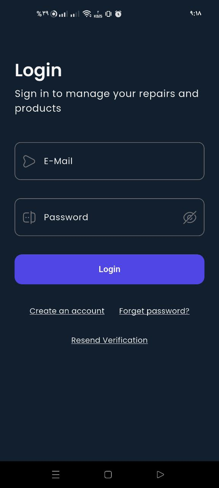
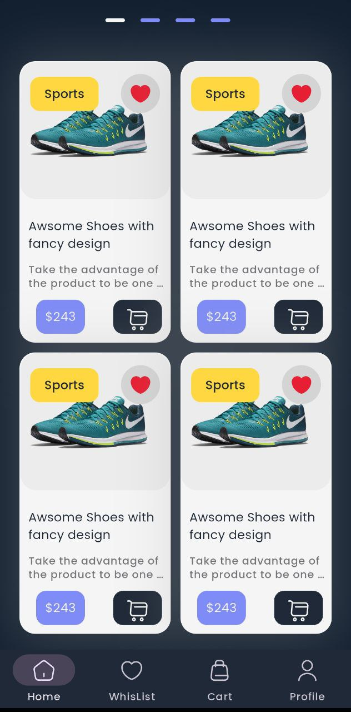

# FixItHub

**FixItHub** is an e-commerce platform focused on device repair and refurbishment. Users can easily request repairs for their devices or purchase professionally fixed and resold items. The goal is to streamline the device repair process and extend the lifecycle of electronic products through a user-friendly digital experience.

---

## 🖼️ Project Demo

### Authentication Screens

  
  
  
  
  
  
  

### Home Screens

  
  

